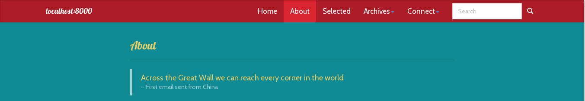
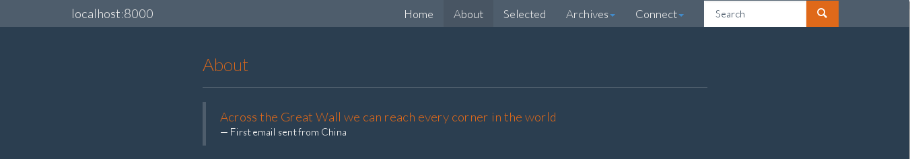
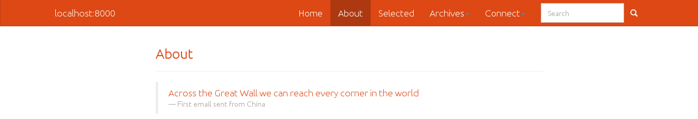

# Pelican-Chameleon

Pelican-chameleon, originally pelican-iliork, is a single-column blog-writing
theme based on [Bootstrap][] for [pelican][]. It provides an elegant way for
switching between different [Bootswatch][] themes (please see [Screen Shots][]
below) like a **chameleon**.  Pelican-chameleon is built on [Bootstrap][] 3.
Some notable features are:

- [Bootswatch][] theme support
- The css of this theme can be overwritten very easily
- Nestable menu items
- Google custom search support
- Multiple authors co-blogging

# Demo

Please check out

* [YueX.in](http://yuex.in), using [Bootswatch][] [Flatly][], in Chinese.
* [Screen Shots][], chameleon with different bootswatch theme

# Congfiguration

## Bootstrap 3 Version and URL Overwriting

You can overwrite the default url of boostrap css and js by setting following
variables. If these variables are not defined, the theme will use the 3.0.0
version of bootstrap.

    BS3_URL = 'https://maxcdn.bootstrapcdn.com/bootstrap/3.3.1/css/bootstrap.min.css'
    BS3_JS  = 'https://maxcdn.bootstrapcdn.com/bootstrap/3.3.1/js/bootstrap.min.js'

## Use Bootstrap Theme

You can change the default appearance of Bootstrap to any Bootstrap theme you
like. `BS3_THEME` defines the url of the theme's css file; `BS3_THEME_NAME` and
`BS3_THEME_HOMEPAGE` define the name and url of bootstrap theme, which are used
in the footer text.

See [Screen Shots][] for demos. For more theme to choose from, have a look at
[Bootswatch][].

    # using Bootswatch Flatly
    BS3_THEME = 'http://bootswatch.com/flatly/bootstrap.min.css'

## Theme CSS Overwriting

You can use your own css file for code highlight. If you do not provide this
value, pelican-chameleon will the default css file, `solarized-light.css`.

pelican-chameleon provides a easy to way to overwrite the css style of
pelican-chameleon by providing `CODE_HIGHLIGHT` and `CSS_OVERWRITE`. When
switching Boostrap themes, you may find these useful.

For example, if you want to use your preferred code highlight css, set the
following option in your `pelicanconf.py`

    CODE_HIGHLIGHT = 'url to your favorite code highlight css'

If you want to overwrite the css style of pelican-chameleon iteself, use

    CSS_OVERWRITE = 'url to your css'

## Nestable Menu Items

Menu items in pelican-chameleon is nestable. `MENUITEMS` are rendered as a top
navbar. Nested menu items are rendered together as a drop-down button on the
top navbar. But only 1-level nesting is allowed; it's clumsy, and perhaps
wrong, to nest too much items in the menu. Here's a example.

    MENUITEMS = [
        ('Home', '/'),
        ('Archives', [
            ('Tags', '/tags.html'),
            ('Categories', '/categories.html'),
            ('Chronological', '/archives.html'),
            ]),
        ('Social', [
            ('Email', 'mailto: maurelinus@stoic.edu'),
            ('Github', 'http://url-to-github-page'),
            ('Facebook', 'http://url-to-facebook-page'),
            ]),
        ]

**NOTE**: If you use absolute domain like '/foo/bar/baz', your SITEURL will be
inserted at the head to work around the redirection issue when hosting under
non-root domain like 'http://stoic.edu/~maurelinus/'.

**NOTE**: Domains starting with `http://` and `https://`, are generated to
`<a>` tag with a `target='_blank'` attribute. For links within your site, use
absolute domain like '/foo/bar/baz', they will be converted to the http style.
Wish this will help to trap more readers. ;)

## Google Custom Search

Put following in your MENUITEMS to have a Google custom search box on top
navbar. 'Search' is the key, mandatory.

    MENUITEMS = [
        ('Search', 'your Google custom search value'),
        ]

## Favicon

To use your favicon, set following option in `pelicanconf.py`

    FAVICON = u'url to your favicon'
    FAVICON_TYPE = u'png or jpeg or whatever'

## Multiple Author
You can direct the author link to whichever you want. It's not hard-coded in
the theme.

    AUTHORS = {
        u'jack': '/about.html',
        u'mary': 'http://mary.info',
        u'tony': 'http://tony.me',
    }

# Screen Shots

pelican-chameleon with default boostrap theme

pelican-chameleon with [Amelia][]

pelican-chameleon with [Cosmo][]

pelican-chameleon with [Superhero][]

pelican-chameleon with [United][]

[pelican]: https://github.com/getpelican/pelican
[Bootstrap]: http://getbootstrap.com
[Bootswatch]: http://bootswatch.com
[Flatly]: http://bootswatch.com/flatly/
[Amelia]: http://bootswatch.com/amelia/
[Cosmo]: http://bootswatch.com/cosmo/
[Superhero]: http://bootswatch.com/superhero/
[United]: http://bootswatch.com/united/
[Screen Shots]: #screen-shots
